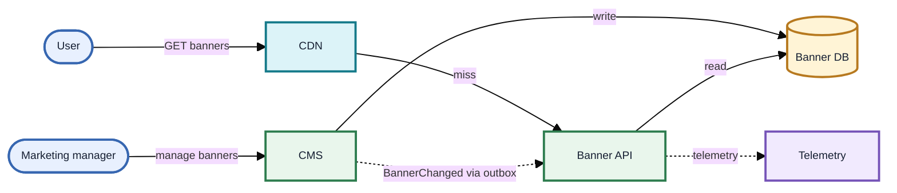
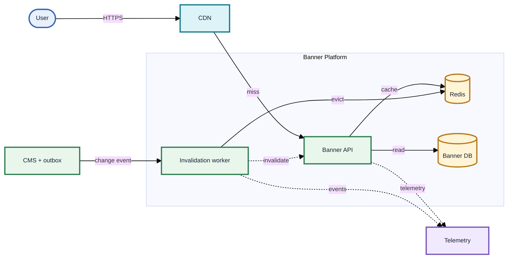
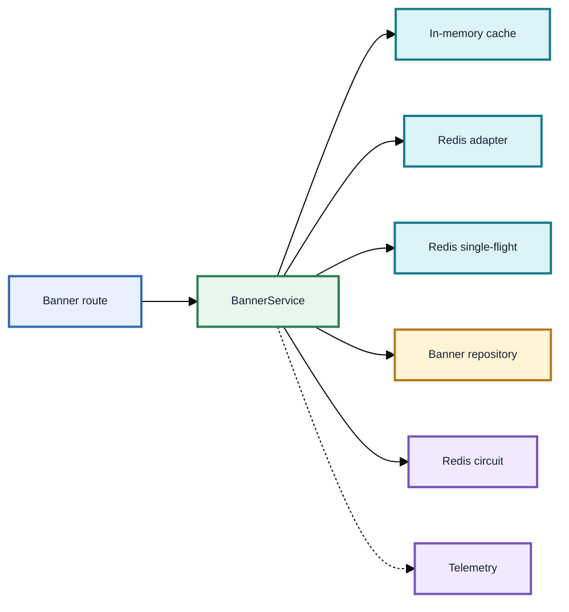
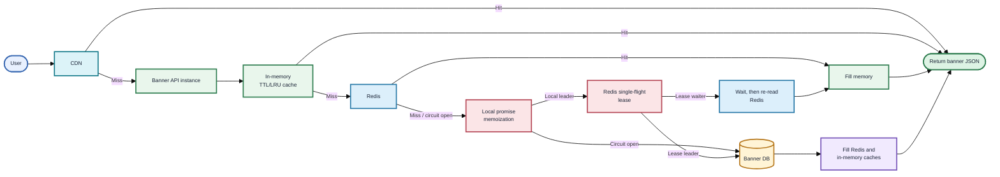
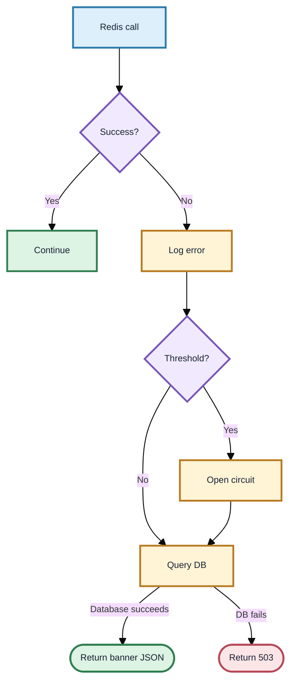
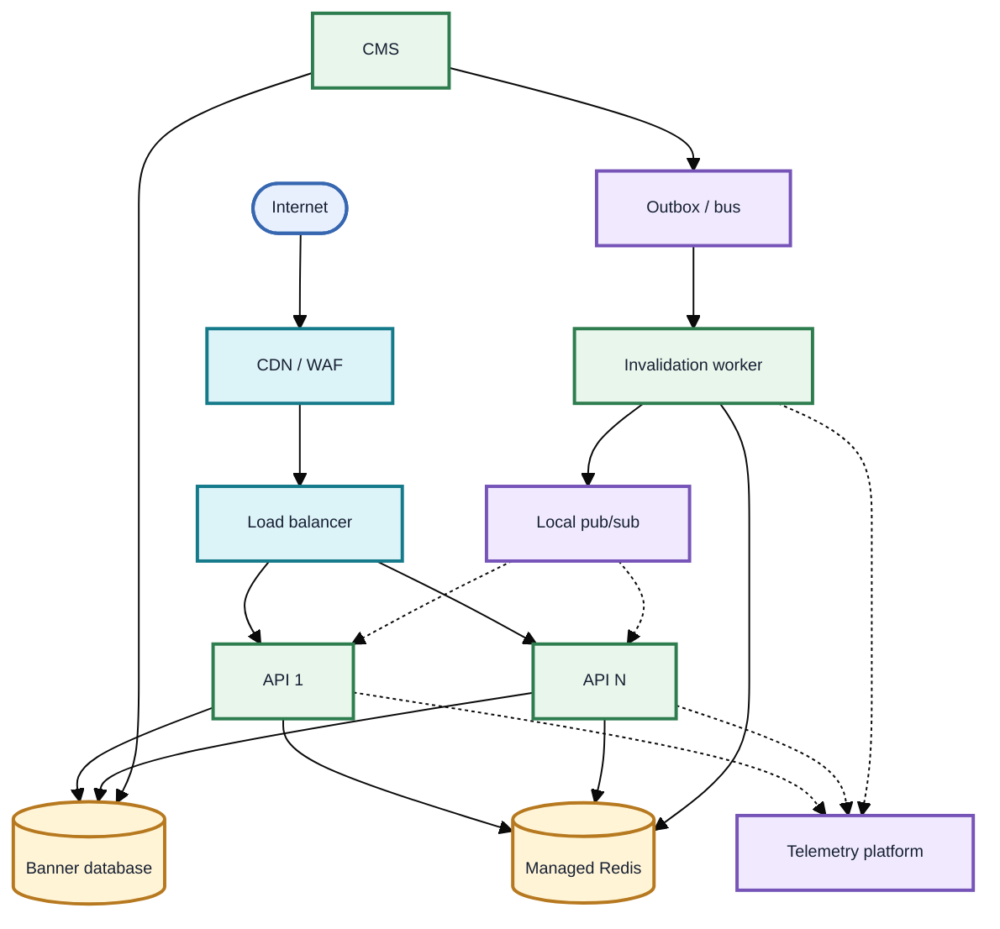

# Banner Delivery Service - Architecture Design

**Status:** Proposed production architecture  
**Scope:** High-volume delivery of promotional banners for user-facing clients  
**Method:** Arc42, with C4-style diagrams

## 1. Introduction and goals

### 1.1 Purpose

The current Node.js endpoint queries the banner database for every request. At more than 5,000 requests per second (RPS), this overloads the database and pushes latency beyond 500 ms. This design makes banner delivery cache-led: the database remains the source of truth but is contacted only on cache misses, invalidation recovery, or cache outages.

### 1.2 Quality goals

| Priority | Goal                 | Measure                                                                                         |
| -------- | -------------------- | ----------------------------------------------------------------------------------------------- |
| 1        | Availability         | Cache outages do not make banner delivery unavailable; database errors return a controlled 503. |
| 2        | Low latency          | Most requests complete at CDN or in-memory cache; track p95 and p99 latency.                    |
| 3        | Database protection  | One database read per cache fill, including when many requests arrive concurrently.             |
| 4        | Fresh-enough content | CMS changes propagate by event-driven invalidation with a bounded TTL fallback.                 |
| 5        | Operability          | Cache-layer, database, Node.js, and business metrics identify degradation before users notice.  |

### Prototype implementation boundary

This document describes the production target and the executable prototype in this repository. The prototype implements the Nginx edge emulator, two API replicas, in-memory and Redis cache-aside, Redis-backed cross-instance request collapsing, MongoDB, resilience controls, and observability. The durable CMS outbox, managed multi-region CDN, and cross-process local-cache broadcast are production integration points: the prototype exposes the same event-consumer boundary but uses an in-process test adapter to prove invalidation semantics without claiming durable delivery.

### 1.3 Stakeholders

| Stakeholder        | Need                                                       |
| ------------------ | ---------------------------------------------------------- |
| Users              | Fast and correct promotional banners.                      |
| Marketing managers | Banner updates become visible promptly and predictably.    |
| Platform engineers | Safe scaling, clear metrics, and easy incident response.   |
| Backend engineers  | Testable TypeScript components with injected dependencies. |

## 2. Constraints

- Node.js 20+, strict TypeScript, Fastify or Express, Docker and Docker Compose.
- Public `GET /api/banners` returns JSON banners ordered by priority and filtered by activity and schedule.
- Redis must fail open, with logging and circuit breaking.
- The service uses cache-aside and request collapsing (promise memoization).
- Docker Compose includes MongoDB and the API uses a real injected MongoDB repository adapter. An in-memory repository is limited to focused unit tests.
- A test workload is configured for 5,000 RPS. Actual sustained throughput depends on hardware, network, and CDN behavior.

## 3. Context and scope

### C4 - System context (Level 1)

**Scope boundary:** authentication and authorization are normally enforced before this public read endpoint, at the CDN/API gateway. The service remains responsible for validating any trusted identity context it consumes and for rate limiting as defence in depth.

## 4. Solution strategy

1. Serve cacheable public reads through a CDN using `s-maxage` and `stale-while-revalidate`.
2. On a CDN miss, use a short-lived, bounded in-memory cache to avoid Redis round trips for hot keys on each API instance.
3. Use Redis as the shared cache across replicas. A Redis hit repopulates the local cache.
4. On an application-cache miss, use request collapsing so only one request loads the database and refills caches for a given key.
5. On Redis error, log and fail open to the database. A circuit breaker bypasses repeated unhealthy Redis calls temporarily.
6. Publish CMS changes through a durable outbox/event flow to invalidate or version all cache keys. TTLs are the safety net if an event is delayed or missed.

## 5. Building block view

### C4 - Container diagram (Level 2)

### C4 - Component diagram (Level 3: Banner API)

## 6. Runtime view

### Banner delivery request lifecycle

### Redis failure behaviour

## 7. Production deployment view

For the test environment, Docker Compose runs an Nginx edge container plus API, Redis, and MongoDB containers, with persistent named volumes and deterministic MongoDB seed data. Only the edge publishes a host port, so the compose topology mirrors the production request path (`user -> edge -> API -> caches -> database`) rather than allowing clients to address the origin directly.

Production runs a real CDN in place of the Nginx container (see 8.0), multiple API replicas behind a load balancer, managed Redis with replication/failover, and MongoDB deployed as a managed replica set behind private networking.

## 8. Cross-cutting concepts

### 8.0 Edge tier: emulator versus production CDN

The repository ships an Nginx `edge` service (`docker/nginx/nginx.conf`) that implements Layer 1 rather than merely documenting it. It is the only service bound to a host port; the API is private to the Docker network, so the edge is genuinely in the request path and cannot be bypassed by accident.

Nginx applies the same cache semantics a CDN applies: a shared cache keyed on the public URL, freshness taken from the origin's `Cache-Control` (`s-maxage`), request collapsing via `proxy_cache_lock`, stale-on-error via `proxy_cache_use_stale`, background revalidation via `proxy_cache_background_update`, and `proxy_cache_bypass`/`proxy_no_cache` on `Authorization` so credentialed responses never enter the shared cache. Error responses carry `Cache-Control: no-store` and no `proxy_cache_valid` exists for any 5xx status, so an outage cannot be latched into the cache.

**This is an emulator of CDN behaviour, not a CDN.** The difference is material when interpreting results:

| Property          | Docker Nginx edge                       | Production CDN                                                    |
| ----------------- | --------------------------------------- | ----------------------------------------------------------------- |
| Topology          | Single node, co-located with the origin | Hundreds of PoPs close to users, often with tiered/shield caching |
| Primary saving    | Origin CPU and database load            | Origin load _and_ wide-area round-trip latency                    |
| Capacity          | One container                           | Effectively unbounded; absorbs volumetric attack traffic          |
| Failure domain    | Shared with the origin host             | Independent; survives loss of an entire origin region             |
| Invalidation      | Restart or volume removal               | Global purge API, typically surrogate-key based                   |
| Additional duties | None                                    | TLS termination, WAF, bot management, geo-routing                 |

Two consequences follow. First, a latency measurement taken through this edge reflects only what caching saved, not what a CDN would save, because there is no geographic distance being eliminated. Second, the stale-during-outage test proves the cache semantics but overstates the resilience: this edge shares a host with the origin, whereas a real CDN keeps serving when the origin's region is entirely gone.

What does transfer unchanged is the contract. Because freshness is expressed in the origin's `Cache-Control` header rather than in `proxy_cache_valid`, swapping this Nginx for CloudFront, Fastly, or Cloudflare requires no application change — the origin already tells any compliant shared cache how to behave.

### 8.1 Cache keys, TTLs, and headers

The executable prototype currently has one public active-banner response shape, so its actual key is `banners:active:v1`. If market, locale, tenant, device, or any other response-shaping dimension is added, it must become part of both the cache key and the edge-cache variation strategy.

- In-memory cache: 5 seconds, bounded to 500 entries per API instance.
- Redis cache: 30 seconds.
- Edge cache: `Cache-Control: public, max-age=10, s-maxage=10, stale-while-revalidate=30`.
- `X-Cache-Status` is the authoritative edge diagnostic. `X-Origin-Served-By` is emitted only for requests that actually contact an API instance; it is deliberately absent on an edge `HIT` so a cached origin header cannot misrepresent the current request.
- Do not cache per-user or sensitive responses in this public key space; the emulator bypasses shared-cache reads and writes when an `Authorization` header is present.

The production tuning range may differ by campaign-correctness requirements and traffic shape. TTL jitter should be added to the shared-cache expiry policy before operating many keys at production scale; it is not claimed as implemented by this prototype.

### 8.2 Consistency and CMS invalidation

The database is authoritative. CMS writes a banner change and an outbox record in the same database transaction. An outbox relay publishes `BannerChanged` after commit. The invalidation worker consumes the event idempotently and deletes/version-bumps affected Redis keys, then broadcasts a local invalidation message to API replicas.

This provides fast, event-driven invalidation but is **eventually consistent**: a small window can exist while CDN, local cache, or Redis entries remain valid. The TTL bounds that window if an event is delayed. Where a campaign requires immediate removal, use a versioned key or a short-lived deny-list consulted before serving and purge the CDN path as part of the CMS command. Monitor invalidation lag and dead-letter events.

In this prototype, `EventConsumer` and `InvalidationListener` provide the same application boundary, while `InProcessEventBus` and the test-only CMS route exercise it deterministically. That adapter evicts the receiving replica's local cache and the shared Redis entry; it does not claim durable, cross-process CMS delivery. Replacing it with an idempotent outbox consumer preserves the `BannerService` contract and supplies the production broadcast/offset-handling behavior described above.

### 8.3 MongoDB data access

**ADR-001 - Repository port over persistence-framework coupling.** The assignment names MongoDB as the legacy database but supplies a PostgreSQL table definition. The ambiguity is resolved by making `BannerRepository` the persistence boundary: `BannerService` consumes domain `Banner` values and does not import an ORM, ODM, MongoDB driver, SQL client, or persistence-specific type. The composition root chooses `MongoBannerRepository` for the executable Docker environment; focused tests use `InMemoryBannerRepository`. A PostgreSQL adapter can implement the same port without changing business logic, cache-aside behavior, request collapsing, circuit breaking, or HTTP serialization.

The PostgreSQL table maps one-to-one to the domain aggregate (`id`, `title`, `imageUrl`, `targetUrl`, `priority`, `isActive`, `startDate`, `endDate`, `createdAt`, `updatedAt`). MongoDB stores that aggregate as a single camelCase document with native BSON dates. Its compound indexes serve status/date queries; PostgreSQL would express the equivalent using a composite B-tree index. This data mapping adds a deliberate, small adapter layer in exchange for engine portability and prevents cache keys and resilience policy from becoming coupled to a particular query framework.

MongoDB is the source of truth for the Docker test environment and production target. The repository queries active banners using the current time and sorts by descending `priority`.

Create and document an index that supports the common read predicate, for example `{ isActive: 1, startDate: 1, endDate: 1, priority: -1 }`; confirm the final index with `explain()` against representative production data because range predicates can affect the optimal compound-index ordering. Docker Compose seeds deterministic banners and creates indexes through an initialization script. MongoDB timeouts and connection-pool limits are configured explicitly; a MongoDB failure is logged and produces the controlled `503` response.

This confirmation is not left as a documentation-only claim: `test/integration/mongo-index-plan.integration.test.ts` runs `explain('executionStats')` against the real seeded collection for the exact `findActive` query and asserts the plan avoids a full collection scan, without asserting a specific answer to the harder question of whether the sort is index-covered or performed in memory (`$or`-expressed optional start/end bounds make that plan-dependent — see README.md "What the index actually does"). Treat the seed data as illustrative, not "representative production data": re-run that test's `explain()` output against real data volume and cardinality before relying on this index design for a production launch.

### 8.4 Request collapsing and cross-instance coordination

An in-flight `Map<cacheKey, Promise<Banner[]>>` in each API instance is retained as the first, zero-network-hop guard. The first local cache-miss request is the local leader; concurrent requests on that same replica await its promise. The map entry is deleted in `finally`, including after database failure.

This mechanism alone is not sufficient across multiple API replicas. The production path therefore adds a Redis-backed **single-flight lease** after the in-memory and Redis data-cache misses:

1. Each local leader attempts `SET banners:lock:<cacheKey> <random-token> NX PX <lease-ms>`.
2. The replica that acquires the lease is the cross-instance leader. It reads the database, fills Redis and the in-memory cache, then publishes a `banners:ready:<cacheKey>` notification.
3. Leaders that do not acquire the lease wait for that notification for a short bounded interval, then re-read Redis. This avoids every replica querying the database.
4. If the notification is delayed, a waiter uses bounded jittered polling of Redis. It never waits indefinitely.
5. The lock owner releases the lease only if the token matches, using an atomic Lua script. The short TTL protects recovery if the owner crashes. Lease duration must exceed the normal database-read and cache-fill duration, with alerting when it is close to expiry.
6. If Redis is unavailable, distributed coordination is unavailable too. The service still fails open to the database; CDN shielding, local memoization, database connection limits, and autoscaling limit the blast radius during that degraded mode.

This gives one database load per cache key across healthy API replicas, rather than one per replica. The database read is idempotent, so the rare case in which a leader outlives its lease is bounded by the short cache TTLs and subsequent invalidation. Strict global write ordering is intentionally outside this prototype: it requires an atomically incremented invalidation generation that covers creates, updates, and deletions, not merely an `updatedAt` value derived from the banners currently returned.

### 8.5 Resilience

- Apply low timeouts to Redis and database operations; do not let one slow dependency consume the Node.js event loop or request pool.
- Redis errors increment a circuit breaker. When open, the API bypasses Redis until the reset interval; exactly one half-open probe is then permitted to restore it after success, preventing recovery from becoming another connection storm.
- Redis failure is fail-open: the API attempts the database and returns valid banners when it can.
- Database failure produces a logged `503` response. Do not serve unboundedly stale content without an explicit product decision.
- Use rate limiting, WAF rules, and autoscaling as complementary protection.

### 8.6 Security and authentication

The public read endpoint is normally protected at the CDN/API gateway with rate limits and, if needed, JWT or signed-session validation. The gateway forwards only verified identity/tenant context. The API never trusts client-supplied tenant headers. CMS write operations require role-based authorization, audit logs, and an authenticated admin boundary. Secrets are supplied through a secret manager, never image layers or source control.

### 8.7 Observability

| Area            | Metrics / telemetry                                                                  |
| --------------- | ------------------------------------------------------------------------------------ |
| User experience | RPS; HTTP status rate; p50, p95, p99 latency; payload size.                          |
| CDN             | Cache-hit ratio; origin fetch rate; purge errors; edge status.                       |
| In-memory cache | Hit/miss/expiry/eviction counts; entry count; memory size.                           |
| Redis           | Hit/miss/error rate; command latency; timeout rate; circuit state and open duration. |
| Database        | Query count; query latency; connection-pool saturation; errors.                      |
| Memoization     | Leaders, joiners/waiters, in-flight count, collapsed database queries.               |
| Invalidation    | Published/consumed/failed events; consumer lag; purge duration; dead-letter count.   |
| Node.js         | Event-loop lag; heap used; RSS; CPU; GC pause/count; active handles.                 |

Use structured logs containing request ID, trace ID, cache key hash, cache outcome, and dependency outcome. Export distributed traces for cache misses and database queries; avoid logging banner content or secrets.

## 9. Architecture decisions

| Decision                                         | Rationale                                                                                       | Trade-off                                                                     |
| ------------------------------------------------ | ----------------------------------------------------------------------------------------------- | ----------------------------------------------------------------------------- |
| CDN + local cache + Redis                        | Absorbs global, per-instance, and shared-cache load at the cheapest practical layer.            | More invalidation paths and observability needs.                              |
| Cache-aside                                      | Simple ownership: application controls reads and cache population.                              | Misses must be carefully collapsed.                                           |
| Local memoization plus Redis single-flight lease | Collapses cache misses within a replica and across healthy replicas.                            | Requires bounded waits, token-safe release, and careful lease-timeout tuning. |
| Fail-open Redis circuit breaker                  | Preserves availability during Redis incidents and reduces failing calls.                        | Database may receive more traffic while Redis is unavailable.                 |
| Event-driven invalidation plus TTL               | Makes changes visible quickly while TTL handles delayed/missed events.                          | Small bounded stale window remains.                                           |
| Repository port / data mapper                    | Resolves MongoDB-versus-PostgreSQL ambiguity and isolates business logic from persistence APIs. | Each engine needs a small, tested adapter and index design.                   |

## 10. Quality requirements and acceptance checks

| Scenario                    | Expected result                                                                                                           |
| --------------------------- | ------------------------------------------------------------------------------------------------------------------------- |
| In-memory hit               | No Redis or database call.                                                                                                |
| In-memory miss, Redis hit   | Populate local cache; no database call.                                                                                   |
| Both caches miss            | Exactly one database query per simultaneous same-key group; populate both caches.                                         |
| Redis unavailable           | Log error, circuit-break as needed, query database, return response.                                                      |
| Database unavailable        | Log error, return 503 JSON response.                                                                                      |
| CMS banner update           | Event invalidates Redis and receiving-replica local keys; CDN is purged if immediate visibility is required.              |
| Edge cold key               | First request reports `X-Cache-Status: MISS` and reaches the origin.                                                      |
| Edge warm key               | Repeat request reports `HIT`; origin request and database counters are unchanged.                                         |
| Concurrent edge misses      | `proxy_cache_lock` collapses them into a single origin request.                                                           |
| Origin stopped, entry stale | Edge serves `STALE` content with HTTP 200 instead of an error.                                                            |
| Origin returns 503          | Never cached at the edge; a repeat request is still a MISS.                                                               |
| 5,000 RPS test              | Run the Dockerized k6 workload; report achieved RPS, latency percentiles, error rate, cache outcomes, and DB query count. |

The benchmark is configured for 5,000 RPS; it does not promise every laptop will sustain it. Record CPU, memory, container limits, and observed throughput with the result.

### Verified local run (Docker Desktop, 2026-07-19)

- Unit tests: 65/65 passed; integration tests: 31/31 passed; production image build passed.
- Warm-cache phase: 149,459 successful requests in 30 seconds (approximately 4,982 RPS).
- All HTTP checks passed; HTTP failure rate was 0%; overall p95 latency was 1.64 ms.
- The cross-instance, cold-cache, and Redis-outage phases completed. Redis was stopped and restored by the harness; Redis errors and an open circuit state were observed as expected.
- 1,061 iterations were dropped during the intentionally degraded Redis-outage phase. They are retained as diagnostic evidence of dependency-timeout pressure, not treated as an API error or a warm-cache capacity result.

## 11. Risks and technical debt

| Risk                                                     | Mitigation                                                                                 |
| -------------------------------------------------------- | ------------------------------------------------------------------------------------------ |
| CDN or cache serves a briefly stale campaign             | Event invalidation, TTLs, purge workflow, and product-defined emergency removal path.      |
| Redis outage shifts load to database                     | Circuit breaker, autoscaling, connection limits, rate limiting, and outage alerting.       |
| Simultaneous expiry causes burst traffic across replicas | CDN shielding, local memoization, Redis single-flight lease, and future shared-TTL jitter. |
| Incorrect cache key mixes markets/locales                | Include all response-shaping inputs in the key; test key isolation.                        |
| Metrics add overhead at high RPS                         | Use counters/histograms with bounded labels and sampling for traces.                       |

## 12. Glossary

| Term               | Meaning                                                                             |
| ------------------ | ----------------------------------------------------------------------------------- |
| Cache-aside        | Application reads cache first, loads source on miss, then stores the result.        |
| CDN                | Edge network that caches responses close to users.                                  |
| Circuit breaker    | Stops calls to a repeatedly failing dependency for a limited interval.              |
| Request collapsing | Multiple identical concurrent cache misses share one in-flight promise.             |
| Outbox pattern     | Persist a domain event with the data change, then publish it reliably after commit. |
